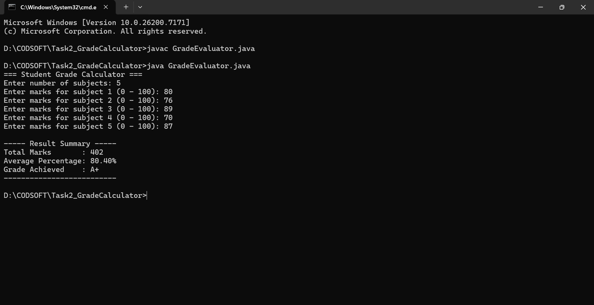

# Task 2 – Student Grade Calculator (Java)

This project is developed as part of the CodSoft Java Programming
Virtual Internship. It is a console-based Java application that
calculates student grades using original logic and structured input
handling.

---

## 📌 Problem Description
The Student Grade Calculator accepts marks for multiple subjects,
computes the total marks and average percentage, and assigns a grade
based on the calculated result.

The program validates user input and displays a clear result summary.

---

## ⚙️ Features
- User-defined number of subjects
- Marks validation (0 to 100)
- Automatic calculation of:
  - Total marks
  - Average percentage
- Grade assignment based on percentage
- Simple and readable console output

---

## 🧠 Program Flow
1. User enters number of subjects.
2. Marks are entered one by one with validation.
3. Total and average percentage are calculated.
4. Grade is assigned based on performance.
5. Final result summary is displayed.

---

## ▶️ Preview (Program Execution Screenshot)

Below is a sample output of the program executed from the command line:

**Observed Output:**
- Subject count: 5
- Total Marks: 402
- Average Percentage: 80.40%
- Grade Achieved: A+

This confirms correct execution and working logic.

---

## 🛠️ Technologies Used
- Java (Core Java)
- Console-based I/O
- Conditional statements and loops

---

## 📂 Folder Structure
Task2_GradeCalculator/
│
├── GradeEvaluator.java
├── README.md
└── preview.png

---

## 🎯 Learning Outcome
Through this task, the following concepts were practiced:
- User input handling
- Loop-based calculations
- Conditional grading logic
- Method-based program structure
- Console application design

---

## 👤 Author
**Sahil Sudhir Londhe**  
Java Programming Intern – CodSoft
