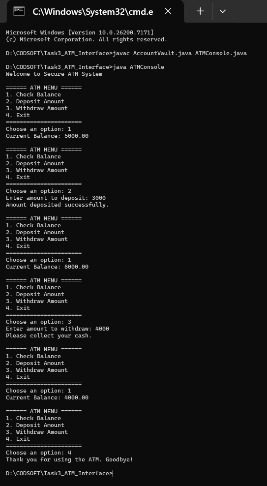

# Task 3 – ATM Interface (Java)

This project is implemented as part of the CodSoft Java Programming
Virtual Internship. The application simulates an ATM system using
core Java concepts and object-oriented programming.

---

## 📌 Problem Description
The objective of this task is to design a console-based ATM interface
that allows a user to perform basic banking operations such as:

- Checking account balance
- Depositing money
- Withdrawing money
- Exiting the ATM session

The system validates user input and updates the account balance
accordingly.

---

## ⚙️ Features
- Menu-driven console interface
- Separate account management class
- Deposit and withdrawal functionality
- Balance validation before transactions
- Continuous session until user exits
- Clear and user-friendly output messages

---

## 🧠 Program Design
The application uses two Java classes:

### 1. AccountVault
- Stores the current account balance
- Handles deposit and withdrawal operations
- Ensures invalid transactions are rejected

### 2. ATMConsole
- Displays ATM menu
- Accepts user choices
- Connects user actions to account operations

This design follows object-oriented principles and keeps logic modular.

---

## ▶️ Preview (Program Execution)

Below is a real execution preview of the ATM system:

### Observed Operations:
- Initial balance check
- Deposit of ₹3000
- Withdrawal of ₹4000
- Updated balance verification
- Graceful exit from the system

---

## 🛠️ Technologies Used
- Java (Core Java)
- Object-Oriented Programming (OOP)
- Console-based input/output

---

## 📂 Folder Structure

Task3_ATM_Interface/
│
├── AccountVault.java
├── ATMConsole.java
├── README.md
└── preview.png

---

## 🎯 Learning Outcome
This task helped in understanding:
- Class interaction in Java
- Encapsulation and data handling
- Menu-driven program execution
- Transaction validation
- Real-world ATM simulation using OOP

---

## 👤 Author
**Sahil Sudhir Londhe**  
Java Programming Intern – CodSoft
