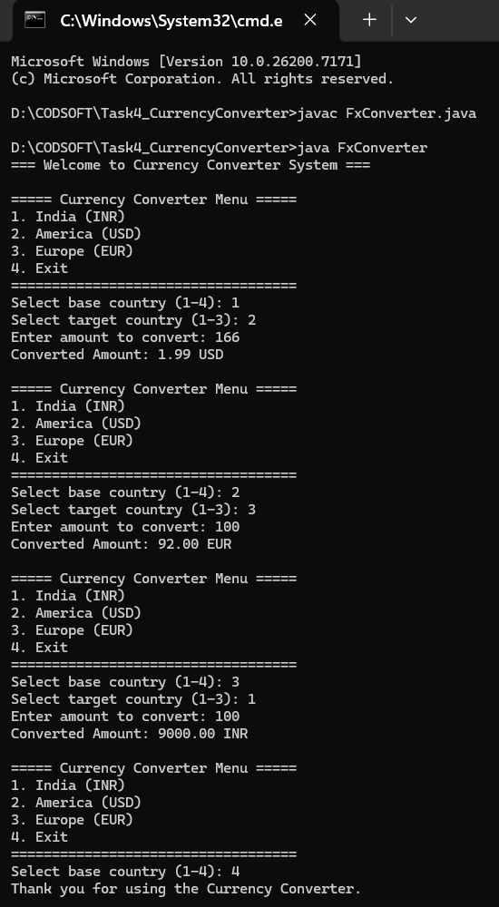

# Task 4 – Currency Converter (Java)

This project is developed as part of the CodSoft Java Programming
Virtual Internship. It is a menu-driven, console-based currency
converter that supports conversion between India, America, and Europe.

---

## 📌 Problem Description
The objective of this task is to design a currency conversion system
that allows users to convert amounts between different countries and
their respective currencies using a simple menu-based interface.

The program supports multiple conversions in a single session and
provides an option to exit safely.

---

## ⚙️ Features
- Menu-based country selection
- Supported countries and currencies:
  - India (INR)
  - America (USD)
  - Europe (EUR)
- Conversion between all supported countries
- Static conversion rates for stable execution
- Continuous operation until user exits
- Clear and formatted output

---

## 🧠 Program Flow
1. Display currency conversion menu.
2. User selects base country.
3. User selects target country.
4. User enters amount to convert.
5. Program calculates and displays converted amount.
6. Menu is shown again until user chooses Exit.

---

## ▶️ Preview (Program Execution)

Below is a real execution preview of the Currency Converter program:

### Demonstrated Conversions:
- India → America (INR to USD)
- America → Europe (USD to EUR)
- Europe → India (EUR to INR)
- Graceful exit from the system

---

## 🛠️ Technologies Used
- Java (Core Java)
- Console-based input/output
- Conditional logic and loops

---

## 📂 Folder Structure

Task4_CurrencyConverter/
│
├── FxConverter.java
├── README.md
└── preview.png

---

## 🎯 Learning Outcome
This task helped in understanding:
- Menu-driven program design
- Conditional decision-making
- Real-world currency conversion logic
- Loop-based user interaction
- Structured console output

---

## 👤 Author
**Sahil Sudhir Londhe**  
Java Programming Intern – CodSoft

